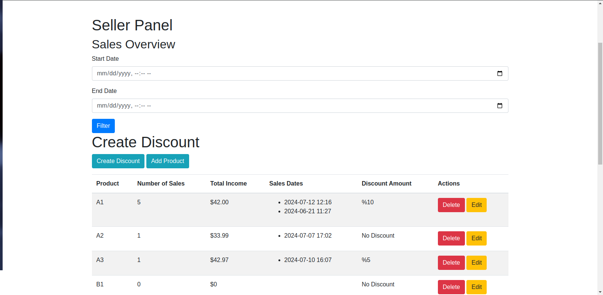
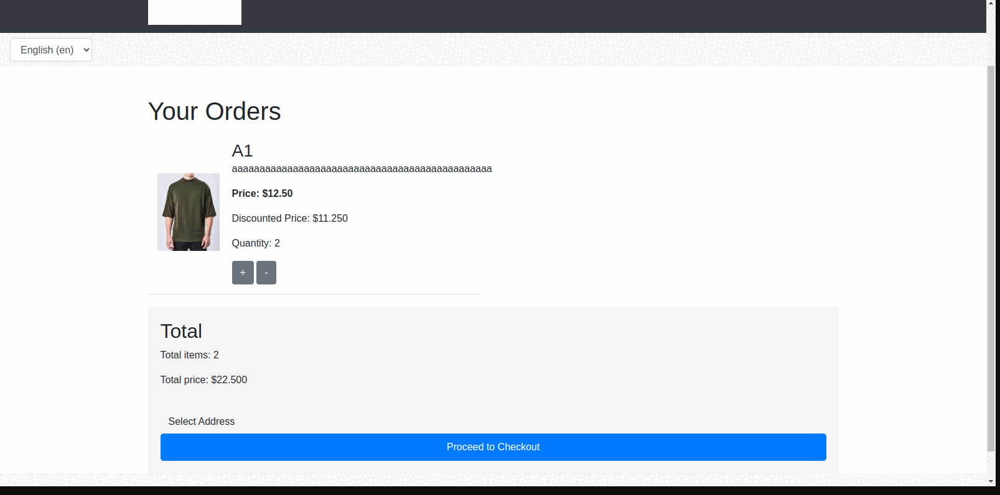

# Online Shop with Django

This project is an e-commerce web application built with Django, featuring a comprehensive set of functionalities including user authentication, product management, discount handling, and asynchronous task management with Celery. 

## Features

- **User Authentication**: Custom user model with registration, login, profile management, and password reset functionalities.
- **Product Management**: Product listing, searching, filtering by category, and reviews.
- **Discounts**: Apply discounts to products and manage discount codes.
- **Orders**: Create and manage orders, including the application of discount codes at checkout.
- **Asynchronous Tasks**: Background task handling with Celery and periodic tasks using Celery Beat.
- **Redis Integration**: Caching and Celery message broker and result backend using Redis.


<h2>Project Screenshots</h2>

<p align="center">
  
  
  
</p>

## Project Slideshow



## Installation

### Prerequisites

- Python 3.8+
- Django 3.2+
- Redis
- Poetry
- Docker


To start Celery worker and beat, open two separate terminal windows and run:

```sh
celery -A config worker --loglevel=info
celery -A config beat --loglevel=info
